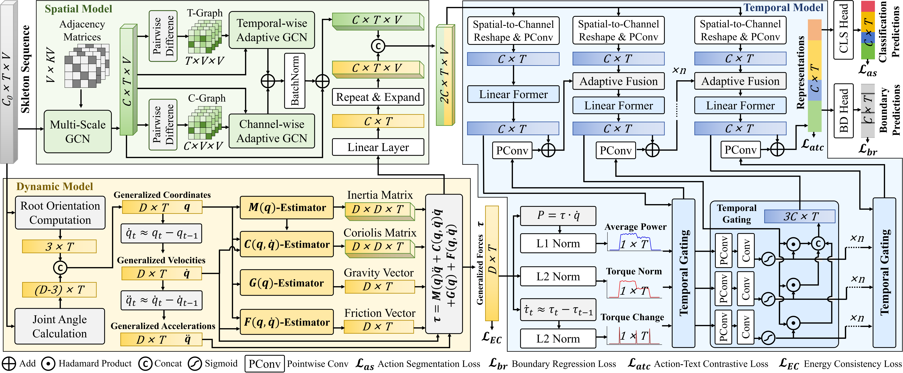

# <p align=center> LaDy: Lagrangian-Dynamic Informed Network for Skeleton-based Action Segmentation via Spatial-Temporal Modulation</p>


> **Abstract:** *Skeleton-based Temporal Action Segmentation (STAS) aims to densely parse untrimmed skeletal sequences into frame-level action categories. However, existing methods, while proficient at capturing spatio-temporal kinematics, neglect the underlying physical dynamics that govern human motion. This oversight limits inter-class discriminability between actions with similar kinematics but distinct dynamic intents, and hinders precise boundary localization where dynamic force profiles shift. To address these, we propose the Lagrangian-Dynamic Informed Network (LaDy), a framework integrating principles of Lagrangian dynamics into the segmentation process. Specifically, LaDy first computes generalized coordinates from joint positions and then estimates Lagrangian terms under physical constraints to explicitly synthesize the generalized forces. To further ensure physical coherence, our Energy Consistency Loss enforces the work-energy theorem, aligning kinetic energy change with the work done by the net force. The learned dynamics then drive a Spatio-Temporal Modulation module: Spatially, generalized forces are fused with spatial representations to provide more discriminative semantics. Temporally, salient dynamic signals are constructed for temporal gating, thereby significantly enhancing boundary awareness. Experiments on challenging datasets show LaDy achieves state-of-the-art performance, validating the integration of physical dynamics for action segmentation.* 

<p align="center">
     <br />
    <em> 
    Figure 1: Overview of the LaDy framework..
    </em>
</p>


## Introduction
The PyTorch code serves as the implementation of the paper: "LaDy: Lagrangian-Dynamic Informed Network for Skeleton-based Action Segmentation via Spatial-Temporal Modulation".
The main contributions of this work are summarized as follows:
1) We propose LaDy, the first framework to introduce Lagrangian dynamics into STAS. Its core is the Lagrangian Dynamics Synthesis (LDS) module, which estimates physics-informed generalized forces to assist segmentation.
2) We introduce a Energy Consistency Loss (ECLoss), a physics-based regularizer that enforces the work-energy theorem to ensure the physical coherence of the forces.
3) We design a dynamics-driven Spatio-Temporal Modulation (STM) that leverages the forces via spatial fusion and hierarchical temporal gating, enhancing action discriminability and boundary localization.
4) We validate LaDy through extensive experiments on six challenging STAS datasets. Our method achieves new state-of-the-art performance, validating our central hypothesis that integrating physical dynamics provides a more discriminative and precise foundation for action segmentation.

> * This implementation code encompasses both training `train.py` and evaluation `evaluation.py` procedures.
> * A single GPU (NVIDIA RTX 3090) can perform all the experiments.

## Enviroment
Pytorch == `1.10.1+cu111`, 
torchvision == `0.11.2`, 
python == `3.8.13`, 
CUDA==`11.4`

### Enviroment Setup
Within the newly instantiated virtual environment, execute the following command to install all dependencies listed in the `requirements.txt` file.

``` python
pip install -r requirements.txt
```

## Datasets
All datasets can be downloaded from
[GoogleDrive](https://drive.google.com/drive/folders/1IwiDpf8D2RLzTbF8IB6D6UxCjXmY6J4s?usp=sharing).

**Note**：This cloud drive contains most of the skeleton-based temporal action segmentation datasets, including **PKU-MMD (X-sub)**, **PKU-MMD (X-view)**, **LARa**, **MCFS-22**, **MCFS-130**, and **TCG-15** datasets.


## Preparation

Orgnize the folder in the following structure (**Note**: please check it carefully):

```
|-- config/
|   |-- MCFS-130/
|   |   -- config.yaml
|-- csv/
|-- datasets/
|   |-- LARA/
|   |   |-- features/
|   |   |-- gt_arr/
|   |   |-- gt_boundary_arr/
|   |   |-- splits/
|   |   |-- mapping.txt
|   |-- MCFS-130/
|   |-- PKU-subject/
|   |-- PKU-view/
|   |-- TCG-15/
|-- libs/
|-- pretrained_models
|   |-- MCFS-130/
|   |   |-- best_test_F1_0.5_model.prm
|-- result/
|-- text_embeddings/
|-- utils/
|-- train.py
|-- evaluate.py

```

- `config/`: Parameter configurations for each dataset.  
- `csv/`: Predefined data splits for each dataset.  
- `datasets/`: Raw dataset files.  
- `libs/`: Core model implementation code.  
- `pretrained_models/`: Trained models (results) on each dataset from this work.  
- `result/`: Output directory for training/evaluation results.  
- `text_embedding/`: BERT-generated embeddings for joint and action class text descriptions (per dataset).  
- `train.py` & `evaluate.py`: Main scripts for training and evaluation respectively.  

* The `result` folder and its contents will be automatically generated during code execution (`result` is the default storage path for results).
* Please download the corresponding four datasets and place them in the `datasets` folder. Alternatively, you may modify the `dataset_dir` parameter in the respective dataset's configuration file (e.g., `config/LARA/config.yaml`) to specify your dataset path.


## Get Started

### Training

To train our model on different datasets, use the following command:

```shell
python train.py --dataset PKU-subject --cuda 0
```

Here, `--dataset` can be one of the following: PKU-subject, PKU-view, LARA, MCFS-22, MCFS-130, or TCG-15. 
`--cuda` specifies the ID number of the GPU to be used for training. 
Additionally, you can use `--result_path` to specify the output path, which defaults to `./result`.

If you wish to modify other parameters, please update the corresponding dataset's configuration file (e.g., `config/PKU-subject/config.yaml`).


### Evaluation

To evaluate the performance of the results obtained after running the training:

```shell
python evaluate.py --dataset PKU-subject --cuda 0
```

Here, `--dataset` and `--cuda` have the same meaning as in the training command. 
Note that if you specify `--result_path` for evaluation, it should match the `--result_path` used in training to ensure the correct trained model parameters are loaded.

Additionally, we provide pretrained models in `pretrained_models/` for all benchmarked datasets. To evaluate our reported results directly, specify the model path via `--model` parameter:

```shell
python evaluate.py --dataset PKU-subject --cuda 0 --model pretrained_models/PKU-subject/best_test_F1_0.5_model.prm
```


## Acknowledgement
The text embeddings for Action-text Contrastive Loss are generated using [BERT](https://github.com/google-research/bert).
Our experiments were conducted on six publicly available datasets: [PKU-MMD (X-sub)](https://www.icst.pku.edu.cn/struct/Projects/PKUMMD.html), [PKU-MMD (X-view)](https://www.icst.pku.edu.cn/struct/Projects/PKUMMD.html), [LARa](https://zenodo.org/records/3862782), [MCFS-22](https://shenglanliu.github.io/mcfs-dataset/), [MCFS-130](https://shenglanliu.github.io/mcfs-dataset/), and [TCG-15](https://github.com/againerju/tcg_recognition).

We sincerely thank the authors for openly sharing their code and datasets, which made this research possible.


## License
This repository is released under the [MIT](https://choosealicense.com/licenses/mit/) License.

